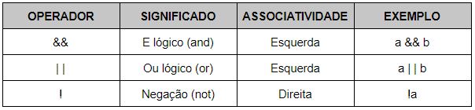
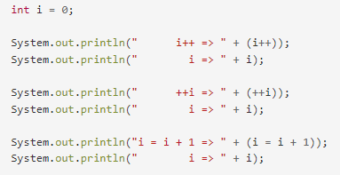

## Escopo de variável

### Entender onde o escopo de uma variável começa e onde termina.

### **Variáveis Globais >** **são aquelas declaradas no início de um algoritmo.** 

**São visíveis**, ou seja, podem ser utilizadas no algoritmo principal e por 
todos os outros subalgoritmos.

**Variáveis Locais** **são aquelas declaradas no início de um subalgoritmo**. 

**São visíveis**, ou seja, podem ser utilizadas somente pelo subalgoritmo onde 
foram declaradas. Outros subalgoritmos ou mesmo o algoritmo principal **não** 
podem utiliza-las.

### A: Onde começa e onde termina - escopo de uma variável 
O escopo de variáveis é o conjunto de regras que determinam o uso e a 
validade de variáveis nas diversas partes do programa. 
declarar variáveis dentro de qualquer bloco. 

**Só para lembrar: um bloco começa quando abrimos uma chave e termina 
quando fechamos a chave.**

**public class Teste** **{**

**}**

### 2 Estrutura de classe
As classes de programação são receitas de um objeto, aonde têm características 
e comportamentos, permitindo assim armazenar propriedades e métodos dentro dela.
Para construir uma classe é preciso utilizar o pilar da abstração. 
Uma classe geralmente representa um substantivo, por exemplo: 
uma pessoa, um lugar, algo que seja “abstrato”.

**A. Formato da construção de uma classe.**

**public class Teste** **{**
            
             //ATRIBUTOS OU PROPRIEDADES

             //MÉTODOS
**}**

**B. Entender o que são variáveis e métodos**

As variáveis, que especificam o estado da classe ou de um objeto 
instância desta classe. 

**=> Os métodos,** que especificam os mecanismos pelos quais 
a classe ou um objeto instância desta classe podem operar.

**=> As variáveis** que especificam o estado da classe ou de um objeto 
instância desta classe.

**Os métodos,** que especificam os mecanismos pelos quais a classe ou um 
objeto instância desta classe podem operar.

Em geral, **um método** recebe argumentos cujos **valores** lhe são passados pelo 
objeto que o chamou, efetua um conjunto de operações e retorna algum resultado. 

A **declaração do método** especifica o nome do método, o tipo de retorno, o nome e 
o tipo de cada argumento. Os argumentos são variáveis locais do método em questão.

**C. Conhecer os tipos de variáveis primitivos**

Variáveis primitivas podem ser do tipo 

**byte, short, int, long, float, double, char ou boolean.**

### 3. Método main

**a. Entender a função do método main.**

A função main serve como o ponto de partida para a execução do programa. 
Em geral, ela controla a execução direcionando as chamadas para outras funções no programa. 
Normalmente, um programa para de ser executado no final de main, embora possa terminar em 
outros pontos no programa por diversos motivos

O **método main** é um método associado à classe e não a um objeto específico da classe -- 
assim, ele é definido como um método estático. 
Adicionalmente, deve ser um método público para permitir sua execução a partir da máquina 
virtual Java

**_****public static void main (String [] args)****_**

**b. Saber declarar um método main (de cabeça).**

**public static void main (String [] args) {

        System.out.printf("Welcome to the principal for....");
**
  }    

### 4. Operadores

**Saber quais são e como usar operadores aritméticos**

Os operadores aritméticos executam operações matemáticas, como adição e subtração com operandos. 

Há dois tipos de operadores matemáticos: **unário e binário**. 

Os operadores unários executam uma ação com um único operando.

**Operadores Aritméticos** ( +, -, *, /, **, % )

**Operadores Aritméticos Unários**
**Operadores unários** são operadores aritméticos que desempenham uma ação 
em um único operando. A linguagem de script reconhece o negativo do operador unário (-).

A = 1;
B = a++; // b será igual a 1, a será igual a 2;

A = 1;

B = ++a; // b será igual a 2, a será igual a 2;

A= 1;

B = a--; // b será igual a 1, a será igual a 0;

**B. Saber quais são e como usar operadores de comparação**

Os **operadores de comparação** são operadores que possuem o objetivo de analisar os valores de uma 
expressão e retornar um valor booleano, ou seja, verdadeiro (1) ou falso (0). 
Cabe mencionar que também existem os operadores lógicos.

**Tabela de operadores de comparação**

_Os operadores mais utilizados na lógica de programação são: **>, >=, <, <=, ==, !=._**

****>** (maior):** Retorna verdadeiro caso o primeiro valor seja maior que o segundo.

****>=** (maior ou igual):** Retorna verdadeiro caso o primeiro valor seja maior ou igual ao segundo.

**< (menor):** Retorna verdadeiro caso o primeiro valor seja menor que o segundo.

**<= (menor ou igual):** Retorna verdadeiro caso o primeiro valor seja menor ou igual ao segundo

**== (igual a):** Retorna verdadeiro caso o primeiro valor seja igual ao segundo.

**!= (diferente de):** Retorna verdadeiro caso o primeiro valor seja diferente do segundo.

System.out.println("X é maior que Y? %d", x > y);

System.out.println("\nX é menor que Y? %d", x < y);

System.out.println("\nX é diferente de Y? %d", x != y);

System.out.println("\nX é igual a Y? %d", x == y);

**Saber quais são e como usar operadores lógicos**

**Os operadores lógicos** representam o recurso que nos permite criar expressões lógicas maiores a partir 
da junção de duas ou mais expressões. 
Para isso, aplicamos as operações lógicas E (representado por “&&”) e OU (representado por “||”). 
Uma vez que utilizamos o operador lógico &&, o System.

**if((1 == (2 -1)) && (2 == (1 + 1))){**
        
            System.out.println(“Ambas as expressões são verdadeiras”);
**}**

**D.Saber quais são e como usar operadores de incremento e decremento**
Quais são os operadores de incremento e decremento?

Há 2 operadores, o de incremento e o de decremento. 
O de **incremento** é representado por dois **sinais de ++** , 
enquanto o de **decremento**, por dois **sinais de menos --** . 
Também é possível trabalhar com o pré-incremento e o pós-incremento, ou então, o
pré-decremento e o pós-decremento.

**Saber quais são e como usar operadores de atribuição de forma direta**

O **operador de atribuição** é utilizado para definir o **valor inicial ou sobrescrever o valor de uma variável**. 
Em seu uso, o operando à esquerda representa a variável para a qual desejamos atribuir o **valor informado** 
à direita.

**Quais os operadores de atribuição da linguagem Java?** 

Em Java, temos um único operador de atribuição simples e 5 operadores compostos. 
O operador simples é representado por um único sinal de igual, enquanto que os operadores compostos 
são constituídos pela junção do operador de atribuição simples junto com um operador matemático.

+=

-=

/=

*=

%=

**Exemplo práticos**

x **-=** 1 (é igual) x = x -' 1;

x **+=** 1 (é igual) x = x +' 1;

x ***=** 1 (é igual) x = x *' 1;

x **/=** 1 (é igual) x = x /' 1;

x **%=** 1 (é igual) x = x %' 1;

