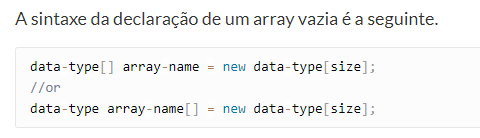
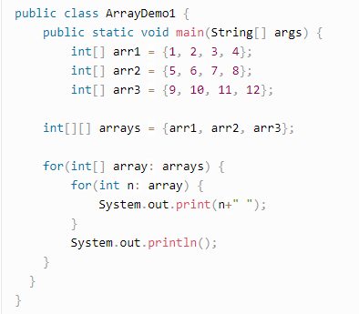

### 4 - Arrays

**1.Declaração de um array**
a.Como declarar e inicializar um array

A sintaxe mais comum é **dataType arrayName[];**

Um Array é uma estrutura de dados que armazena uma coleção 
sequencial de tamanho fixo de elementos do mesmo tipo.

public class Main {

    public static void main(String[] args) {
        
        int[] arrayInt;
    }
}

****b.Entender o tipo de um array****

**Arrays** só permiti armazenar dados do mesmo tipo em
todas as suas posições.

Exemplo de declaração de array:

**double[] salarios;**

**double salarios[];** 

// Ambas as formas são válidas.**

**2.Tipos de inicialização de um array**

a.Entender todos os tipos possíveis para inicializar um array
Matriz:

**dataType arrayName[];** para declarar um novo array

**ArrayName = new dataType[size];** para alocar o tamanho do Array

**ArrayName[index]** = value/element para inicializar o array com valores/elementos

**dataType[] arrayName** = new dataType[]{elementos} para inicializar o array sem tamanho

b.Como criar uma matriz utilizando arrays

Criamos um ARRAY usando o operador **new**.

Sintaxe:

**tipoDado[] varivaelreferencia = new tipoDado[tamanhoArray;]**

