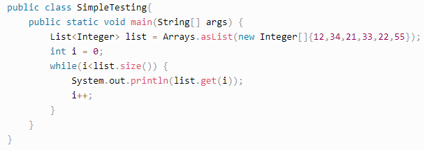

# 3 - Estrutura de Repetição I

### 1.WHILE
**A.Estrutura da cláusula WHILE**

O funcionamento é o seguinte: 

**Testa a condição:** 

Se a condição for falsa então pula todos os comandos do bloco subordinado 
ao while e passa a executar os comandos após o bloco do while. 

Se condição for verdadeira então executa cada um dos comandos do 
bloco subordinado ao while

**B.Tipo de valor aceito na condição do WHILE**

Somente se a condição **for verdadeira o corpo do laço de repetição**, 
com seus respectivos comandos, serão executados. 
Portanto, o conteúdo será repetido até que esta condição não seja 
mais verdadeira.

**C.Entender o que é um loop infinito**

Um loop ou laço infinito é aquele que apresenta sempre uma condição de teste verdadeira,
ou seja, nunca termina.
Isto ocorre quando escreve acidentalmente uma condição que jamais será satisfeita, 
ou então esquece de alterar o valor da variável de controle do laço fazendo com que a 
condição permaneça verdadeira para sempre.

**D.Saber como evitar loops**

**E.Entender como parar um fluxo WHILE**

Para sair do loop while, você pode fazer os seguintes métodos:

Saia depois de completar o loop normalmente.

Saia usando a instrução **break**.

Saia usando a instrução **return**.

### DO WHILE
**A.Estrutura da cláusula DO WHILE**

**B.Entender quando executar o DO WHILE**
Esta instrução é usada quando não sabemos quantas vezes um determinado bloco de instruções 
precisa ser repetido. Com ele, a execução das instruções vai continuar até que uma condição 
seja verdadeira. 
A condição a ser analisada para a execução do laço de repetição deverá retornar um 
valor booleano

**C.Entender como parar um fluxo DO WHILE**

Para **sair** de um **fluxo while** e necessário que a condição seja veradeira
com os **comandos break e return.**

Saia de um loop while usando break em Java

Saia de um loop while usando return em Java

### FOR
**A.Estrutura da cláusula FOR**
O laço for é uma estrutura de repetição muito utilizada nos programas java. 
É muito útil quando se sabe de antemão quantas vezes a repetição deverá ser executada. 
Este laço utiliza uma variável para controlar a contagem do loop, bem como seu incremento

**B.Entender as três divisões do FOR**

    for(parte1; parte2; parte3)

	parte1: é onde nós declaramos uma variável
        
	parte2: é onde nós colocamos uma condição
        	para qeu continue ou seja terminado
        
	parte3: é onde nós incrementamos a nossa variável

**C.O que usar em cada parte do FOR**

É possível encontrarmos diversas formas de iterar os elementos com laço For em Java, mas
basicamente, ela é escrita da seguinte forma:

for (int x = 0; x < y; x++) {

...

}

for (inicialização da variável; checagem de condição; 

incremento/decremento do valor da variável) {  

comando a ser executado/declaração

}

**D.Entender quando usar um FOR**

A estrutura de repetição "for", ou então, laço de repetição, iterador é a estrutura mais 
utilizada quando precisamos executar diversas vezes um mesmo bloco de código. 
Isso porque, conseguimos facilmente declarar, inicializar e incrementar valores no 
cabeçalho da estrutura. 

Logo, nós temos que o nosso código acaba por ficar encapsulado, o que confere 
segurança na execução do laço como também, uma melhor legibilidade do código e 
maior produtividade do programador.