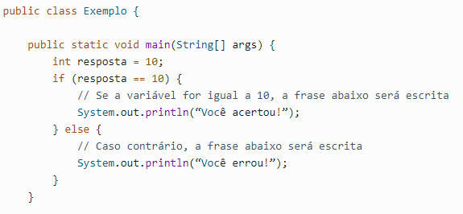
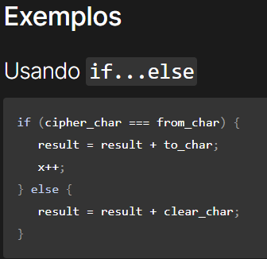
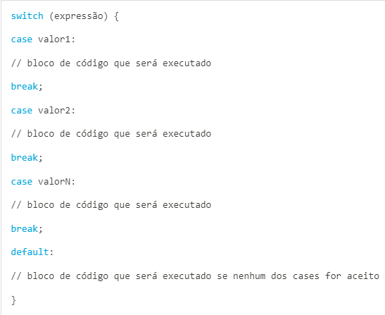

## IF = 

### A. Estrutura da cláusula IF

As estruturas de condição possibilitam ao programa tomar decisões e alterar o seu 
fluxo de execução. É por meio delas que podemos dizer ao sistema: 
“execute a instrução A caso a expressão X seja verdadeira; 
caso contrário, execute a instrução B”. 

Na linguagem Java temos três recursos para criação de estruturas de decisão: if/else, 
operador ternário e switch/case. Este documento apresentamos a opção if/else e o operador ternário.

**if (expressão booleana) {

// bloco de código 1

} else {

// bloco de código 2

}**

### **B.Tipo de dado aceito como condição**
Você pode concatenar expressões booleanas através dos operadores lógicos **“E”** e **“OU”**.
O **“E”** é representado pelo & e o “OU” é representado pelo |

### **C.Ordem de execução do fluxo (quando entra no IF)**

Apenas caso a **condição_do_if** for verdadeira, o bloco contendo os comandos 
**comando_1** a **comando_m** é executado. 

Caso contrário, esse bloco não é executado e a execução do programa continua com o comando 
comando_após_if.

### 2 . IF ELSE

**A.Estrutura da cláusula IF / ELSE**

O **if/else** é uma estrutura de condição em que uma expressão booleana é analisada. 
Quando a condição que estiver dentro do if for verdadeira, ela é executada. 
Já o else é utilizado para definir o que é executado quando a condição 
analisada pelo if for falsa. 
Caso o if seja verdadeiro e, consequentemente executado, o else não é executado.

### B.Ordem de execução do fluxo com o else (quando entra no IF e quando entra no ELSE).

Como os termos indicam, uma estrutura do tipo if-else permite a execução de um ou outro 
código, dependento de uma condição ser verdadeira ou falsa.

A sintaxe básica é mostrada abaixo. Observem o uso de uma expressão lógica entre parênteses e 
chaves envolvendo os códigos executados como cada resultado da expressão lógica.

if (expressão lógica) { 

        se expressão lógica for verdadeira

        faça isso

} else {

        senão faça outra coisa

}

### ELSE IF
**A.Como utilizar o ELSE / IF**

A declaração if-else em java também testa uma condição. 
Executa se a condição do bloco if é verdadeira caso contrário o bloco else é 
executado

if(condicao) {
        
    //código da condição if é verdadeira.
    
    } else {
       
     //código da condição if é falsa.
}

**B.Quando um fluxo ELSE / IF é necessário**

A condicional if é uma estrutura condicional que executa a afirmação, 
dentro do bloco, se determinada condição for verdadeira. 
Se for falsa, executa as afirmações dentro de else.

**Ordem de execução de um fluxo com IF, ELSE / IF e ELSE**

     

### 4.SWITCH

**A.Estrutura da cláusula SWITCH**

O switch case é uma estrutura de decisão usada quando precisamos testar condições para 
determinar qual função será executada em seguida. 
Assim, essa expressão nos permite substituir múltiplos “if else if”, 
tornando o código criado mais simples, legível e fácil de manter.

**B.Tipo de parâmetro aceito na condição de execução**

O funcionamento da estrutura switch é bastante simples.
Inicialmente, o valor da variável passada no switch é comparado com os valores fornecidos
em cada case.
Se um desses valores for igual ao valor da variável, o bloco de código do case em questão
será executado.

**C.Quando uma estrutura de condição SWITCH é necessário**

É uma estrutura muito importante para **testar condições de uma forma simples e intuitiva**, 
**reduzindo a necessidade de criar blocos de código complexo usando vários if else encadeados.**

